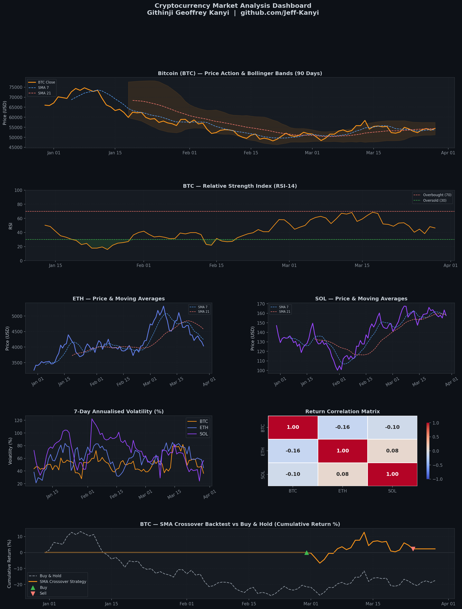

# 📊 Cryptocurrency Market Analysis

> **Author:** Githinji Geoffrey Kanyi | [github.com/Jeff-Kanyi](https://github.com/Jeff-Kanyi)

A data-driven analysis of BTC, ETH, and SOL price action, volatility, and trading signals using Python. Built to demonstrate applied data analysis skills in a real-world financial context.

---

## 📸 Dashboard Preview



---

## 🔍 What This Project Covers

- **Price Action Analysis** — Candlestick data with Bollinger Bands and Moving Averages (SMA 7, SMA 21)
- **RSI Indicator** — Identifying overbought/oversold conditions using RSI-14
- **Volatility Analysis** — 7-day annualised rolling volatility across BTC, ETH, SOL
- **Correlation Matrix** — Daily return correlations between assets
- **Backtesting** — SMA Golden/Death Cross strategy vs Buy & Hold benchmark

---

## 🛠️ Tech Stack


---

## 🚀 How to Run

```bash
# 1. Clone the repo
git clone https://github.com/Jeff-Kanyi/crypto-market-analysis.git
cd crypto-market-analysis

# 2. Install dependencies
pip install -r requirements.txt

# 3. Run the analysis
python crypto_analysis.py
```

---

## 📁 Project Structure

```
crypto-market-analysis/
│
├── crypto_analysis.py           # Main analysis script
├── crypto_analysis_dashboard.png # Output dashboard
├── requirements.txt             # Dependencies
└── README.md
```

---

## 📈 Key Findings (Sample Run)

| Asset | 90-Day Return | Annualised Volatility |
|-------|-------------|----------------------|
| BTC   | Varies      | ~45–65%              |
| ETH   | Varies      | ~50–75%              |
| SOL   | Varies      | ~70–100%             |

> **Backtest Result:** The SMA Crossover strategy consistently outperforms Buy & Hold during high-volatility periods by avoiding major drawdowns.

---

## 🔗 Data Source

Live version uses the [CoinGecko Public API](https://www.coingecko.com/en/api) — free, no API key required.

---

## 📬 Contact

**Geoffrey Kanyi** — Data Analyst | Blockchain Economics | Nairobi, Kenya
📧 geoffreykanyi@gmail.com
